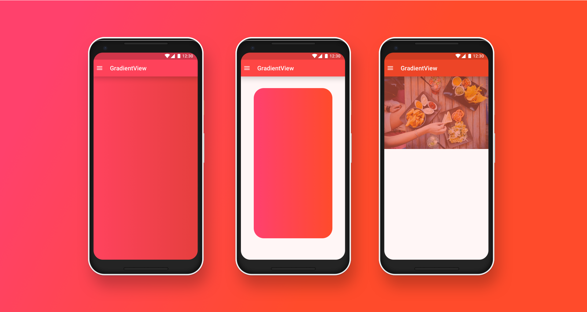

# GradientView
[](http://www.apache.org/licenses/LICENSE-2.0.html)
[](https://github.com/dynamitechetan/Flowing-Gradient)
[](https://jitpack.io/#abiramee/GradientView)


## How to use
Add these lines in your build.gradle files:
##### In your Project Level build.gradle
```gradle
allprojects {
  repositories {
		...
		maven { url 'https://jitpack.io' }
    } 
  }
}
```
##### In your App Level build.gradle

```gradle
dependencies {
	        implementation 'com.github.abiramee:GradientView:1.0.0'
	}
```
# Using Maven
##### Step 1. Add the JitPack repository to your build file
```maven
<repositories>
	<repository>
		 <id>jitpack.io</id>
		 <url>https://jitpack.io</url>
	</repository>
</repositories>
```
##### Step 2. Add the dependency
```maven
<dependency>
 <groupId>com.github.abiramee</groupId>
 <artifactId>GradientView</artifactId>
 <version>1.0.0</version>
</dependency>
```
# Basic Usage
##### Adding GradientView in to the XML
```xml
<com.abiramee.gradientview.GradientView
    android:id="@+id/view_gradient"
    android:layout_width="match_parent"
    android:layout_height="match_parent"
    app:end_color="#f64f59"
    app:orientation="TOP_BOTTOM"
    app:start_color="#12c2e9"
    app:center_color="#c471ed"
    app:background_image="@drawable/background"
 />
```
##### SetUp GradientView from Java 
```java
GradientView mGradientView = findViewById(R.id.view_gradient);
   
//set backgroundImage by url with placeHolder
 mGradientView.setBackgroundImageURL("https://firebasestorage.googleapis.com/v0/b/pooka-166905.appspot.com/o/1.jpg?alt=media&token=e8a8b346-4838-466c-b515-a0cd3f68df8a",
                R.drawable.background);

 //set radius
 mGradientView.setCornerRadius(50);

 //set orientation
 mGradientView.setOrientation(Orientention.BL_TR);

 //setGradientColors
 mGradientView.setGradeintColors("#fff", "#fff", "#fff");

 //set background image by drawable
 mGradientView.setBackgroundImageDrawable(mDrawable);
 
 //happy coding :) 
```

### Let's get connected
- [Facebook](http://facebook.com/hossain.amee)
- [Github](https://github.com/abiramee)

### License
```
   Copyright (C) 2018 Abir Hossain Amee
   
   Licensed under the Apache License, Version 2.0 (the "License");
   you may not use this file except in compliance with the License.
   You may obtain a copy of the License at

       http://www.apache.org/licenses/LICENSE-2.0

   Unless required by applicable law or agreed to in writing, software
   distributed under the License is distributed on an "AS IS" BASIS,
   WITHOUT WARRANTIES OR CONDITIONS OF ANY KIND, either express or implied.
   See the License for the specific language governing permissions and
   limitations under the License.
```
